# Bad Arts Entertainment Milestone Project

##### Live URL: [Bad Arts Entertainment](https://badartsentertainment.com/)

## Introduction

This webpage has been designed for a Limerick based rap label which represents several local hip-hop artists.
The objective of the project is to create an all-in-one platform for Bad Arts Entertainment to connect their social media presence which is spread across multiple websites. This website will pull content from Twitter & Youtube while also linking to Spotify & Bandcamp.
The website will also be used as a promotional tool for the label to advertise future albums & merchandise. Information about previous concerts they have preformed at will also be on display. This will help the label engage with their audience and build a community of fans.

## UX

Before beginning the design process (ie. creating wireframes and choosing the colour scheme), I reviewed Bad Arts Entertainment's current online presence.
The company had already designed a logo, an orange smiley face on a black background with red lettering(see below).

### Project Goals

When starting the design process, a major goal was to design a UX which worked in harmony with their logo & brand identity.
Irish rap music is a niche genre and the UX has to engage it's small but growing target audience. The colour and font selection had to be edgy while still being highly legible. 
To reflect the tone of the music, I used a black background paired with the logo's bold orange colouring [#ff4500]. White was then used to highlight certain pieces of text, making the overall content more legible by the user of contrast.
For the title within the navbar, I chose a dramatic font called Holtwood One SC. All other text was styled using the highly legible Kanit font.

### User stories

1. As a new fan of Bad Arts Entertainment I want:

    * The ability to easily find music and videos from each individual artist to enable me to learn more about the label.
    * A clearly defined navigation bar so that I can move around the site effectively.
    * Information pertaining to each artist and their connections with each other to get a better understanding of the label as a whole.
    * A way to view their social feed without having to leave the webpage.
    * A method to interact with the label's social media content which is split across several external sites. 
    * To be subscribed to a mailing list in order to be kept up to date with any future releases or events.

##### Artist Bio 

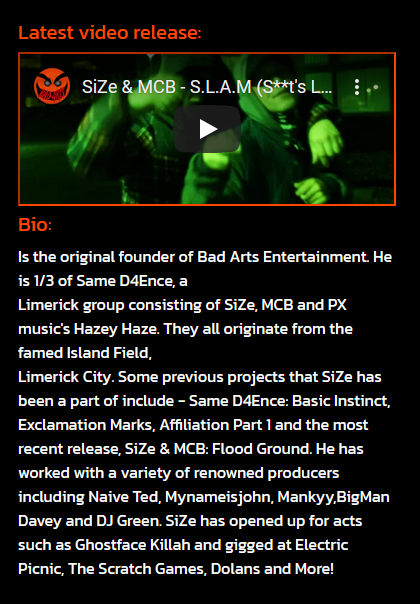

##### Mailing List

2. As a fan that would like to purchase a specific artist's album I need:

    * A music/video gallery to decide which album is right for me.
    * A link to an internal/external shop where I can purchase the album for a reasonable price.

##### Bandcamp link

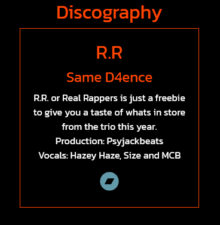

##### Video Gallery

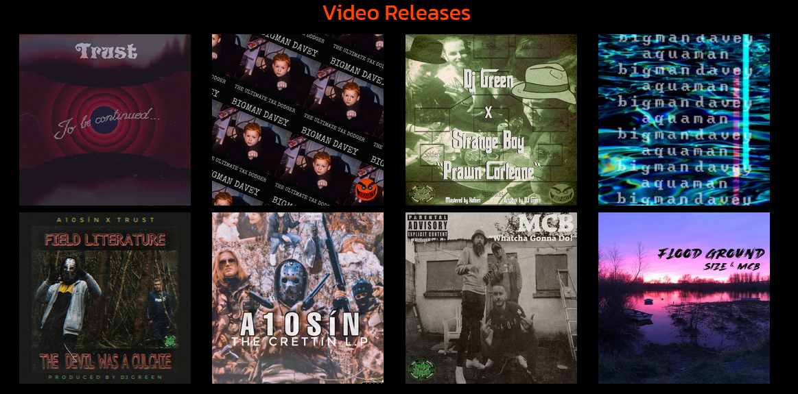

3. As a music venue promoter I need:

    * A place to review the label's music and videos to see if they're a suitable act for their venue.
    * The ability to view previous events that the label has been a part of.
    * A method to get in contact with the label in order to book their artists for concerts.

##### Events Page

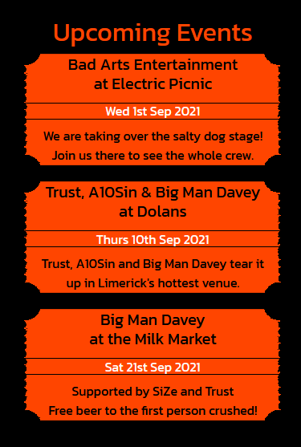

##### Contact 

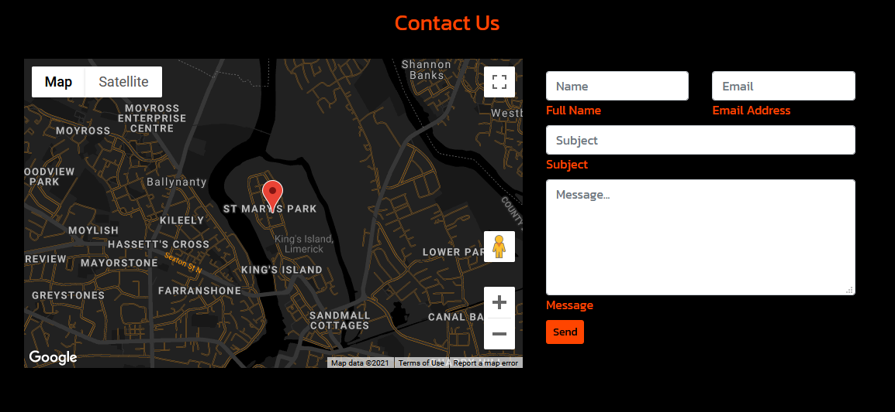

4. As a music PR agent I need:

    * An area to review past and future events held by the label.
    * A video gallery containing the majority of their releases.
    * A gateway to the label's external social media presence.

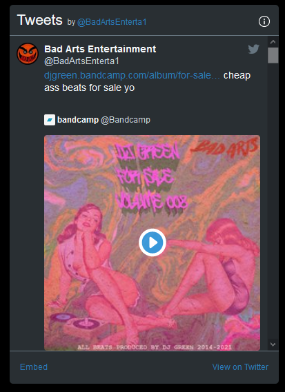

### Design Choices

As the company's target demographic is young men aged 18-30, design choices were made with this audience in mind. 

#### Fonts

* For the hero title within the navigation bar, a dramatic font called Holtwood One SC was chosen. I selected it due it's resemblance to certain movie posters titles such as Clockwork Orange & Pulp Fiction.
* All other text is presented in the Kanit font. This font was chosen for its legibility but also reflects the hip-hop label's no-nonsense attitude.

#### Icons

* Before I drew up the wireframes, the music label had sent me their pre-designed logo. This is used for the favicon and the navigation bar.
* All other icons were chosen for their obvious meaning and purpose so that they can be understood by everyone.

#### Colours

* The primary colour choices of black and orange were chosen work in harmony the previously designed Bad Arts Entertainment logo.

* The secondary colour white was chosen for large blocks of text to provide contrast and increase legibility.

#### Styling

* Event containers were given a custom image as a background in order to give them the resemblance of a ticket stub.

* Custom carousel arrows were created using an orange and white colour scheme to blend in with the previous chosen colours.

## Existing Features

#### Mailing List Modal

* Allows users to join the Bad Arts Entertainment mailing list.
* This feature appears only appears on index.html 45 seconds after the page has finished loading.

#### Rotating card carousel

* This component provides a rotating card for each new release the label would like to present to the user.
* The card's front contains the song artwork and the card's back contains a blurb and a link to Spotify where the user can listen to the track.
* A separate mobile version of this feature was developed containing 1 card instead of 3 due to the decrease in screen size.

#### Artist profile accordion

* This component displays information on several artists while minimising the space required.
* The user clicks the plus icon expanding the accordion to display the artist's bio.
* This icon changes to a minus symbol once the component has expanded.

#### Custom event div

* A custom background image was created from a Google image source using a photo editing software called Gimp.
* The container image resembles a ticket stub giving visual context to the webpage's event section.

#### Video Gallery

* This component was created using the Bootstrap grid and a plugin called Fancybox.

#### Shop

* This page allows the user to view an array of products, each of which links to a separate product page.
* Bootstrap grid was also used here.

#### Product page

* Here the user can add their desired product to their cart while viewing item prices and current discounts.

#### Contact form

* This page gives the user information on where the music label is based by using an embedded Google Maps iframe.
* It also contains a contact form allowing the user to email Bad Arts Entertainment directly.

## Performance

#### Image Resizing & Compression

* Full size images were resized using Gimp to 1600px maintaining the same aspect ratio.
* Then the images were passed through the TinyJPG compression tool to further reduce the application weight.

#### Autoprefixing

* As no autoprefixing extension existed for Gitpod, an external extension was added to the repository [Autoprefixer](https://www.vsixhub.com/vsix/7708/)

## Technologies Used

[JQuery](https://jquery.com/) - The Jquery script tag is required in order to load Bootstrap.

[Bootstrap](https://getbootstrap.com/)
Bootstrap was one of the technologies that was requested for us to use for our milestone project. 
I decided to use this framework to implement several features on the site including the navbar, a carousel and a grid containing 4 cards (each having an image, some text and a link).

[Youtube Video Embedding tool](https://www.classynemesis.com/projects/ytembed/)
This technology was used to convert Youtube videos into html iframe elements.

[Image Resizer](https://picresize.com/)
At times, working with images can be a difficult task. This free website was used mainly to crop images into square profile photos.

[Image Compression](https://tinyjpg.com/)
Used to decrease Time to Live & application weight.

[Google Fonts](https://fonts.google.com/)
The site used to choose and implement custom fonts.

[Icons](https://fontawesome.com/)
Website used to source footer icons

[Photo Editing Software](https://www.gimp.org/)
Used to create custom event ticket container

## Testing

#### Validation

* The developer used W3C CSS validation service and W3C Markup validation service to check the validity of their code.

#### Performance Testing

* Lighthouse within Chrome developer tools was used to observe areas where application performance could be improved.
  
#### Common paths

Most common paths through the website:

##### Home > Videos
  
##### Home > Shop > Product

  * A back button represented by a white leftwards arrow was added to each product page to ensure that site visitors can easily return to the shop page. A link in the navbar also has this functionality, the second button was added as it follows modern online shopping conventions.

##### Home > Contact

#### Testing client's stories outlined in the UX section:

1. As a new visitor to the website, I want to be able to navigate the site easily and be able to find what I want quickly.
    
    * No matter what page a new visitor lands on, they're able to easily find and use the navigation bar.
    * The logo image and hero title are links that always lead back to the homepage.
    * The landing section of the homepage contains a description of the music label, their genre and location.

2. As a new visitor to the site, I want to be able to find specific artists.

    * On the home page, artist's profiles are grouped together in order to aid the site visitor find the intended artist quickly and provide the scope of the label.

3. As a new visitor to the website, I want the ability to read personal information relating to each artist, so I can understand their lyrics in context.

    * Each artist profile contains a concise biography and their latest video release.

4. As a fan, I want the ability to purchase physical/digital copies of their music.
   
    * On the homepage, each artist's profile has a link to their Bandcamp page where potential customers can purchase their music digitally.
    * Within shop.html , physical media will be available for sale once it is in stock.

5. As a fan, I want to be able to interact with social media from their Twitter account.

    * Near the bottom of the homepage, there is an embedded twitter timeline where users can read the label's entire feed.
    * A twitter follow button has also been placed within the footer, which has been synchronised across all pages.

6. As a potential employer, I would like the ability to see previous events they have done in order to make a more calculated business decision on whether to hire one of the label's artists.

    * The events section on the homepage outlines previous events that the label has taken part in as well as any upcoming gigs planned.

7. As a potential customer, I would like the ability to view their merchandise with clearly indicated pricing.

    * In the shop, prices are outlined for each product once you hover over them. Also, within the product page, the current and previous product price is clearly outlined.

8. As a potential customer, I want to be able to navigate between the shop and individual product pages with ease.

    * At the top left of each product page, a left arrow icon allows the user to return to the shop with ease.
    * This icon was chosen for its obvious meaning and purpose so that it can be understood by everyone.

9. As a potential employer, I would like the ability to contact the label directly.

    * On the contact page, there is a contact form in order to get in touch with Bad Arts Entertainment.
  

10. As a fan, I would like to know precisely where the music label is located.

    * On the contact page, there contains a Google Map element showing where the label is based.
    * If you click on the map marker, a small blurb of the area is provided.

## Bugs Discovered:

#### Solved bugs

1. Z-index of navbar on mobile
    
    * The navbar dropdown tile worked on every page besides index.html.
    * After requesting help from the tutor team at Code Institute, we found that the issue was arrising due to the z-index of the navbar in relation to the carousel. 
    * The navbar has now been given a z-index:10 and the problem has been resolved.

        .nav{
            z-index: 10;
        }

2. Bootstrap accordion not collapsing

    * The accordion wouldn't collapse once it had been opened. You could see the browser attempting to close the accordion, creating a glitching effect.
    * I reviewed the bootstrap documentation and tried several potential solutions involving class names.
    * After triple checking my code to ensure that it matched the Bootstrap documentation, I knew that a new solution was needed.
    * A JS script was needed to close the accordion manually.

      $('.open-close1').collapse('toggle', {
            parent: '#accordion1'
        });  

3. Rotating card carousel not mobile friendly

    * As the browser window decreased to mobile size, a 3 card carousel wouldn't fit aesthetically.
    * I created 2 separate carousels, a 3 card carousel for screens 768px and above & a single card carousel for screens 768px and below.
    * The bootstrap class names used to achieve this; Desktop[ d-none d-md-block ] & Mobile [ d-md-none ].

        Class name for desktop carousel
        

        Class name for mobile carousel
        

4. Index.html footer too long
   
    * After completing the design of the website, I noticed that there was ~700px of empty blackspace beneath where the footer ended.
    * I tried to create a fixed height for the body but this had unwanted consequences.
    * The current solution was to wrap the entire webpage in a div and set overflow to hidden.

        #content-wrapper{
            overflow: hidden; 
        }

## Deployment

This project was developed using Gitpod, committed to git and pushed to Github using the built-in function with Gitpod.

To deploy this page from Github pages from its Github repository, the following steps were taken.

1. Log into Github.
2. From the list of repositories on the screen, select saoirse-defi/milestone1-bad-arts-1.0.
3. From the menu items near the top of the page, select Settings.
4. Scroll down to the Github Pages section.
5. Under source click the drop-down menu labelled None and select Master Branch.
6. On selecting Master Branch, the page is automatically refreshed, the website is now deployed.
   
At the moment of submitting this milestone project, the default branch is version1.2 which is the latest version.

#### How to run this project locally:

To clone this project into Gitpod you will need:
1. A Github account
2. Use the Chrome browser

Then follow these steps:
1. Install the Gitpod browser extensions for Chrome
2. After installation, restart the browser
3. Log into Gitpod with your Gitpod account
4. Navigate to the Github project repository
5. Click the green 'Gitpod' button in the top right corner of the repository
6. This will trigger a new Gitpod workspace to be created from the code in Github where you can work locally

To work on the code within a local IDE such as VScode:
1. Follow this link to the Github repository
2. Under the repository name, click 'clone' or 'download'
3. In the clone with the https section, copy the clone URL for the repository
4. In your local IDE, open the terminal
5. Change the current working directory to the location where you want the cloned directory to be made.
6. Type 'git clone', and then paste the URL copied in step 3

git clone https://www.Github.com/USERNAME/REPOSITORY

7. Press enter. Your local clone will be created.

Further reading and troubleshooting on cloning a repository can be found here [Github](https://docs.Github.com/en/free-pro-team@latest/Github/creating-cloning-and-archiving-repositories/cloning-a-repository).

## Credit

### Media

#### Carousel & Card Images

* All carousel & Card images were provided by the label who are the sole owners of the copyright.

* As this site will be used by a real musical organisation, I was given permission to use any videos or images owned by Bad Arts Entertainment.

#### Videos

* All videos were taken from the Bad Arts Entertainment Youtube channel.

* I considered using local video files for the video gallery but during implementation, website performance became noticeable issue.

#### Icons 

* All icons including social media, accordion plus/minus and product page's back button have all been sourced from [FontAwesome](https://www.fontawesome.com).

#### External Images:

* In shop.html I have used 5 external images sourced from google images using the search term 'merch'.

### Code

#### General CSS knowledge:

https://www.youtube.com/watch?v=jx5jmI0UlXU&t
https://www.w3schools.com/cssref/css3_pr_background-size.asp
https://www.w3schools.com/css/css_align.asp
https://www.w3schools.com/css/css3_object-fit.asp
https://www.w3schools.com/cssref/sel_before.asp
https://www.w3schools.com/tags/tag_strike.asp
https://css-tricks.com/snippets/sass/black-white-opacity-mixins/
These videos and articles helped me understand certain crucial CSS properties such as position, background, object-fit and text-align.

#### Form Styling:

https://blog.logrocket.com/how-to-style-forms-with-css-a-beginners-guide/
I don't believe that I copied any code directly from this site but it influenced my decisions relating to the footer contact form styling.

#### Hover text effect associated with shop.html:

https://www.youtube.com/watch?v=ltxxNidblts

#### Bootstrap Navbar and associated issues:

https://stackoverflow.com/questions/44988543/bootstrap-navbar-transparent-on-mobile
https://stackoverflow.com/questions/22383547/bootstrap-dropdown-menu-is-not-working
https://stackoverflow.com/questions/19204937/div-doesnt-position-itself-below-bootstrap-fixed-navbar
I used these Stackoverflow articles to troubleshoot the bugs outlined in the above section.

#### Video Gallery:

https://fancyapps.com/fancybox/3/

#### Bootstrap custom icon colour:

https://stackoverflow.com/questions/46249541/change-arrow-colors-in-bootstraps-carousel

#### Customising the Google Map:

https://developers.google.com/maps/documentation/javascript/styling
https://developers.google.com/maps/documentation/javascript/adding-a-google-map

#### Text over image:

https://css-tricks.com/design-considerations-text-images/

#### Flyout Modal:

https://www.solodev.com/blog/web-design/bootstrap/how-to-create-a-flyout-bootstrap-modal.stml

#### Card Flip Carousel:
https://www.youtube.com/watch?v=jVhwJgLOoGw
https://mdbootstrap.com/snippets/jquery/alexpiffero-it/696600

#### Internal Links:

https://www.yourhtmlsource.com/text/internallinks.html
I've implemented for one of the buttons on the navbar to bring you to the bottom of the page, to the contact section.

## Wireframes

### Home(desktop)

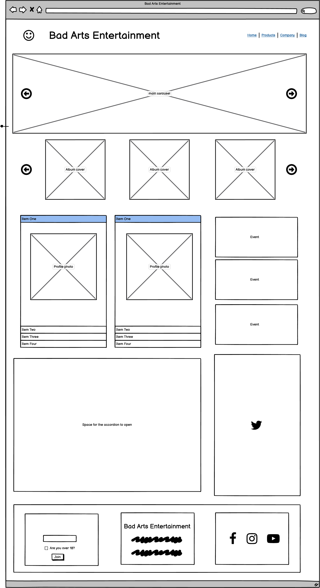

### Home(tablet)

.html.png)

### Home(mobile)

.html.png)

### Videos(desktop)

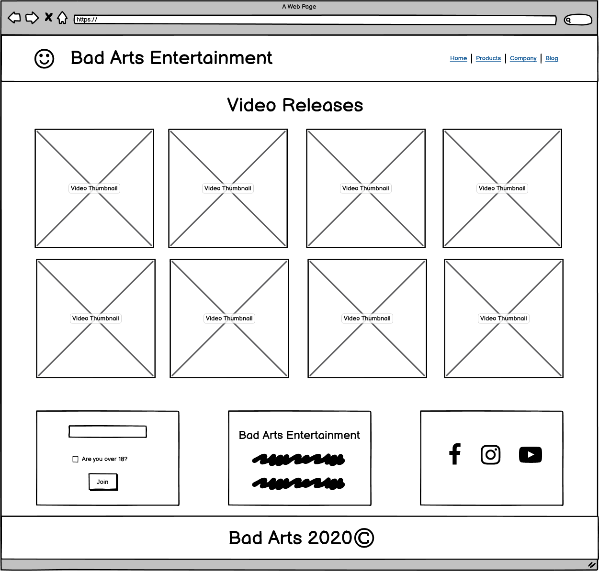

### Videos(tablet)

.html.png)

### Videos(mobile)

.html.png)

### Shop(desktop)

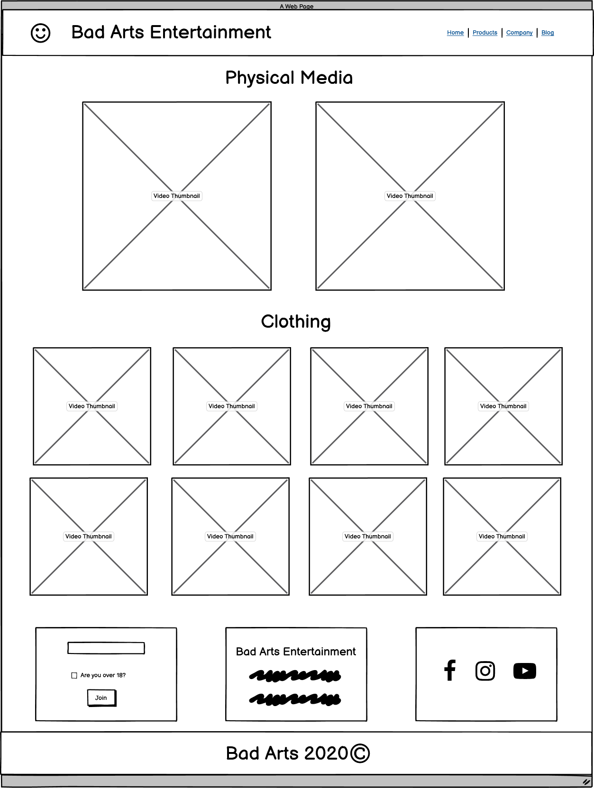

### Shop(tablet)

.html.png)

### Shop(mobile)

.html.png)

### Product(desktop)

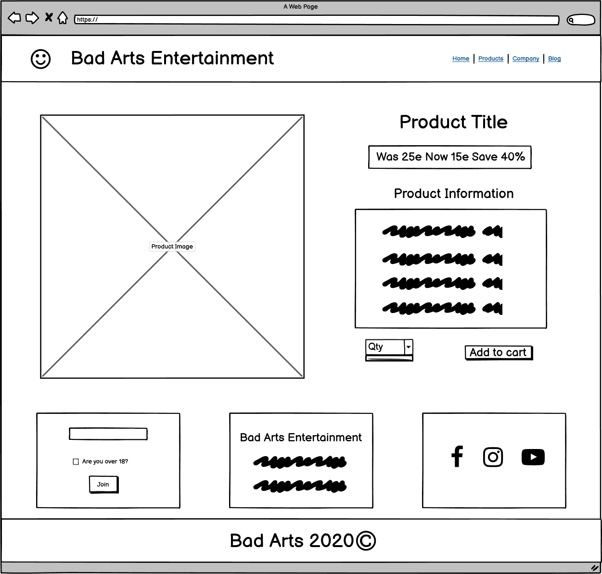

### Product(tablet)

.html.png)

### Product(mobile)

.html.png)

### Contact(desktop)

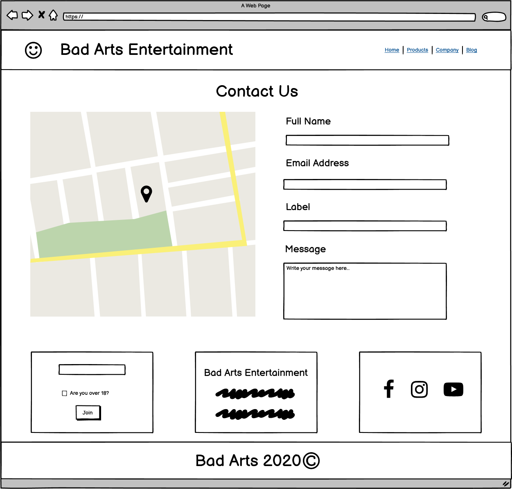

### Contact(tablet)

.html.png)

### Contact(mobile)

.html.png)

